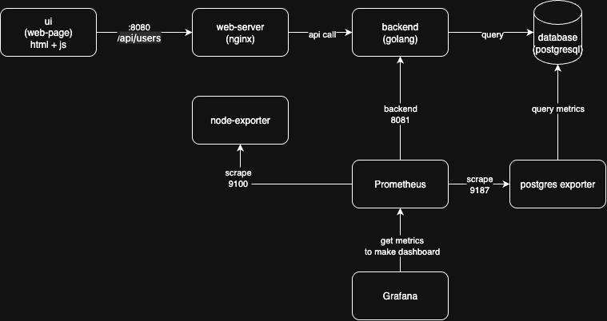

# Demo App 1 — Highload System Design

Учебный проект.

Демонстрирует полный стек: REST API, реляционная СУБД, reverse proxy, сбор метрик, визуализация и нагрузочное тестирование — всё поднимается одной командой через Docker Compose.



---

## Содержание

- [Стек технологий](#стек-технологий)
- [Архитектура](#архитектура)
- [Структура репозитория](#структура-репозитория)
- [Быстрый старт](#быстрый-старт)
- [Сервисы и порты](#сервисы-и-порты)
- [API](#api)
- [Схема базы данных](#схема-базы-данных)
- [Observability](#observability)
- [Нагрузочное тестирование](#нагрузочное-тестирование)
- [Горизонтальное масштабирование (HAProxy)](#горизонтальное-масштабирование-haproxy)
- [Разработка и расширение](#разработка-и-расширение)
- [FAQ](#faq)

---

## Стек технологий

| Слой | Технология |
|---|---|
| Backend | Go 1.21, [Gorilla Mux](https://github.com/gorilla/mux), lib/pq |
| Frontend | HTML + Vanilla JavaScript (статика) |
| Web-server / Reverse Proxy | Nginx (alpine) |
| База данных | PostgreSQL 15 |
| Контейнеризация | Docker, Docker Compose |
| Мониторинг | Prometheus, Grafana 9.0 |
| Экспортеры метрик | node-exporter, postgres-exporter, cAdvisor |
| Нагрузочное тестирование | Grafana k6 |
| Load Balancer (опц.) | HAProxy |

---

## Архитектура

```
Browser
  │
  ▼
Nginx :8080  ──── /         ──► static files (ui/)
             ──── /api/     ──► Backend :8081
             ──── /metrics  ──► Backend :8081

Backend :8081
  ├── REST API  (/api/users, /api/orders)
  ├── Prometheus metrics  (/metrics)
  └── PostgreSQL :5432

Prometheus :9090
  ├── scrape: backend :8081/metrics
  ├── scrape: postgres-exporter :9187
  ├── scrape: node-exporter :9100
  └── scrape: cAdvisor :8080

Grafana :3000  ◄── datasource ── Prometheus
k6 :6565       ──► remote_write ──► Prometheus
```

**Альтернативный режим** (`docker-compose-lb.yaml`): HAProxy заменяет Nginx и балансирует трафик между тремя инстансами Backend по алгоритму round-robin.

---

## Структура репозитория

```
demo-app-1/
├── backend/
│   ├── Dockerfile          # Multistage-сборка Go-приложения
│   ├── main.go             # HTTP-сервер, CRUD-обработчики, метрики
│   ├── go.mod
│   └── go.sum
├── ui/
│   └── index.html          # SPA: формы создания пользователей и заказов
├── migrations/
│   └── 001_init.sql        # DDL: таблицы users и orders
├── nginx/
│   └── default.conf        # Конфиг web-server + reverse proxy
├── haproxy/
│   └── haproxy.cfg         # Конфиг балансировщика (опционально)
├── prometheus/
│   └── prometheus.yml      # Список scrape-job'ов
├── k6/
│   └── scripts/
│       └── load-script.js  # Сценарий нагрузочного тестирования
├── dashboards/             # JSON-файлы дашбордов Grafana
│   ├── Node Exporter Full-*.json
│   ├── Postgres Overview-*.json
│   └── k6 Prometheus-*.json
├── images/
│   ├── image.png           # Скриншот дашборда Grafana
│   └── Схема.drawio.png    # Архитектурная схема
├── docker-compose.yaml     # Стандартный деплой
└── docker-compose-lb.yaml  # Деплой с HAProxy + 3 backend-инстанса
```

---

## Быстрый старт

**Требования**: Docker, Docker Compose.

```bash
# 1. Клонировать репозиторий
git clone https://github.com/nikolaysavelev/system-design-practice-hse-miem-25-26.git
cd system-design-practice-hse-miem-25-26/demo-app-1

# 2. Собрать и запустить все сервисы
docker-compose up -d --build

# 3. Проверить, что все контейнеры запущены
docker ps
```

Через 15–20 секунд все контейнеры должны иметь статус `Up`.

### Проверка работоспособности

```bash
# Создать пользователя
curl -s -X POST http://localhost:8081/api/users \
  -H "Content-Type: application/json" \
  -d '{"name":"Alice","email":"alice@example.com"}' | jq

# Создать заказ (user_id из предыдущего ответа)
curl -s -X POST http://localhost:8081/api/orders \
  -H "Content-Type: application/json" \
  -d '{"user_id":1,"amount":99.99,"description":"Test order"}' | jq

# Получить список пользователей
curl -s http://localhost:8081/api/users | jq
```

---

## Сервисы и порты

| Сервис | URL | Описание |
|---|---|---|
| UI | http://localhost:8080 | Веб-интерфейс (через Nginx) |
| Backend API | http://localhost:8081/api | REST API напрямую |
| Prometheus | http://localhost:9090 | Интерфейс запросов к метрикам |
| Grafana | http://localhost:3000 | Дашборды (`admin` / `admin`) |
| node-exporter | http://localhost:9100/metrics | Метрики хост-машины |
| postgres-exporter | http://localhost:9187/metrics | Метрики PostgreSQL |
| cAdvisor | http://localhost:8088 | Метрики контейнеров |
| k6 | http://localhost:6565 | Статус нагрузочного теста |
| PostgreSQL | localhost:5432 | БД (`demo` / `demo`) |

---

## API

Base URL: `http://localhost:8081/api`

Все запросы и ответы — JSON.

### Пользователи (`/users`)

| Метод | Путь | Описание | Тело запроса |
|---|---|---|---|
| `POST` | `/users` | Создать пользователя | `{"name":"...","email":"..."}` |
| `GET` | `/users` | Получить список (до 100, DESC) | — |
| `GET` | `/users/{id}` | Получить пользователя по ID | — |
| `PUT` | `/users/{id}` | Обновить пользователя | `{"name":"...","email":"..."}` |
| `DELETE` | `/users/{id}` | Удалить пользователя | — |

**Модель `User`**

```json
{
  "id": 1,
  "name": "Alice",
  "email": "alice@example.com",
  "created_at": "2025-09-01T12:00:00Z"
}
```

### Заказы (`/orders`)

| Метод | Путь | Описание | Тело запроса |
|---|---|---|---|
| `POST` | `/orders` | Создать заказ | `{"user_id":1,"amount":99.99,"description":"..."}` |
| `GET` | `/orders` | Получить список (до 100, DESC) | — |
| `GET` | `/orders/{id}` | Получить заказ по ID | — |
| `PUT` | `/orders/{id}` | Обновить заказ | `{"user_id":1,"amount":49.99,"description":"..."}` |
| `DELETE` | `/orders/{id}` | Удалить заказ | — |

**Модель `Order`**

```json
{
  "id": 1,
  "user_id": 1,
  "amount": 99.99,
  "description": "Test order",
  "created_at": "2025-09-01T12:05:00Z"
}
```

### Метрики

| Метод | Путь | Описание |
|---|---|---|
| `GET` | `/metrics` | Prometheus-метрики в формате OpenMetrics |

**Кастомные метрики бэкенда**

| Метрика | Тип | Лейблы | Описание |
|---|---|---|---|
| `http_request_duration_seconds` | histogram | `method`, `path`, `status` | Время обработки HTTP-запроса |
| `http_requests_total` | counter | `method`, `path`, `status` | Количество HTTP-запросов |
| `db_query_duration_seconds` | histogram | `method`, `path`, `status` | Время выполнения SQL-запроса |

---

## Схема базы данных

Файл: [migrations/001_init.sql](migrations/001_init.sql)

```sql
CREATE TABLE users (
    id         SERIAL PRIMARY KEY,
    name       TEXT NOT NULL,
    email      TEXT NOT NULL UNIQUE,
    created_at TIMESTAMPTZ DEFAULT now()
);

CREATE TABLE orders (
    id          SERIAL PRIMARY KEY,
    user_id     INT NOT NULL REFERENCES users(id) ON DELETE CASCADE,
    amount      NUMERIC(10,2) NOT NULL,
    description TEXT,
    created_at  TIMESTAMPTZ DEFAULT now()
);
```

Миграции применяются автоматически при старте контейнера `db` через `initdb.d`.

---

## Observability

### Prometheus

Конфиг: [prometheus/prometheus.yml](prometheus/prometheus.yml)

Prometheus собирает метрики с четырёх источников:

| Job | Адрес | Что мониторит |
|---|---|---|
| `backend` | `backend:8081` | HTTP-запросы, запросы к БД |
| `postgres` | `postgres_exporter:9187` | Соединения, запросы, locks, pg_stat_statements |
| `node` | `node_exporter:9100` | CPU, память, диск, сеть хост-машины |
| `cadvisor` | `cadvisor:8080` | CPU/RAM контейнеров |

### Grafana

1. Откройте http://localhost:3000 (admin / admin)
2. Добавьте Data Source → Prometheus → URL: `http://prometheus:9090` → **Save & Test**
3. Импортируйте дашборды из папки [dashboards/](dashboards/) или по ID с grafana.com:
   - **Node Exporter Full** — состояние хоста
   - **Postgres Overview** — производительность базы
   - **k6 Prometheus** — результаты нагрузочных тестов

> Если дашборды не подтягивают данные автоматически, зайдите в каждый дашборд → Variables → выставьте datasource Prometheus.

---

## Нагрузочное тестирование

Скрипт: [k6/scripts/load-script.js](k6/scripts/load-script.js)

**Профиль нагрузки**

| Этап | Длительность | VU |
|---|---|---|
| Разогрев | 30 с | 0 → 1000 |
| Снижение | 30 с | 1000 → 100 |
| Плато | 1 мин | 100 → 200 |
| Завершение | 2 мин | 200 → 0 |

**Распределение запросов**: 80 % — `POST /api/orders`, 20 % — `GET /api/orders`.

Результаты пишутся в Prometheus через remote write и отображаются на дашборде **k6 Prometheus** в Grafana.

```bash
# Запустить нагрузочный тест вручную
docker-compose run --rm k6 run /scripts/load-script.js
```

---

## Горизонтальное масштабирование (HAProxy)

Альтернативный `docker-compose-lb.yaml` разворачивает три инстанса бэкенда за HAProxy:

```
HAProxy :8080  ──round-robin──►  backend   :8081
                                 backend-2 :8082
                                 backend-3 :8083
```

```bash
# Запустить вариант с балансировкой
docker-compose -f docker-compose-lb.yaml up -d --build
```

Конфигурация балансировщика: [haproxy/haproxy.cfg](haproxy/haproxy.cfg)

---

## FAQ

**Как подключиться к базе данных?**

```
Host: localhost
Port: 5432
Database: demo
User: demo
Password: demo
JDBC URL: jdbc:postgresql://localhost:5432/demo
```

**Контейнер `db` падает при старте** — возможно, порт 5432 занят локальным PostgreSQL. Остановите его или измените маппинг порта в `docker-compose.yaml`.

**Grafana не показывает данные** — убедитесь, что Data Source Prometheus указан правильно (`http://prometheus:9090`, а не `localhost:9090`), и обновите Variables в каждом дашборде.

**k6 не пишет метрики в Prometheus** — проверьте, что Prometheus запущен и доступен до старта k6. Порядок зависимостей задан через `depends_on` в `docker-compose.yaml`.

**Как посмотреть логи конкретного сервиса?**

```bash
docker logs demo-app-1-nginx-1 -f
docker logs demo-app-1-backend-1 -f
docker logs demo-app-1-db-1 -f
```
